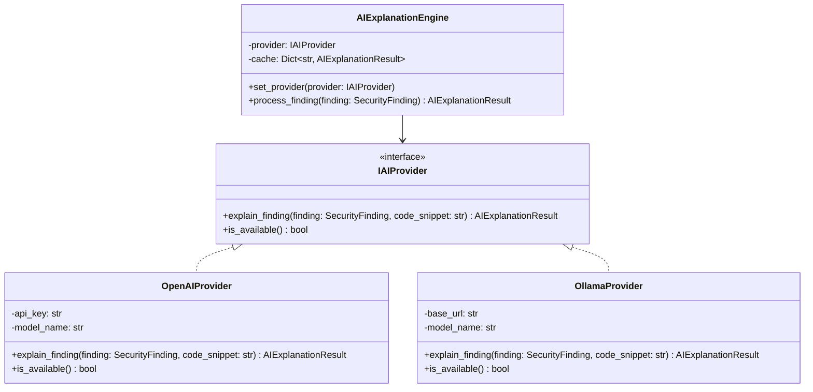
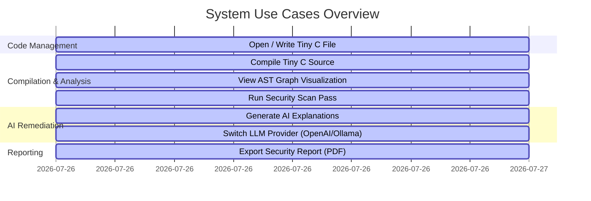
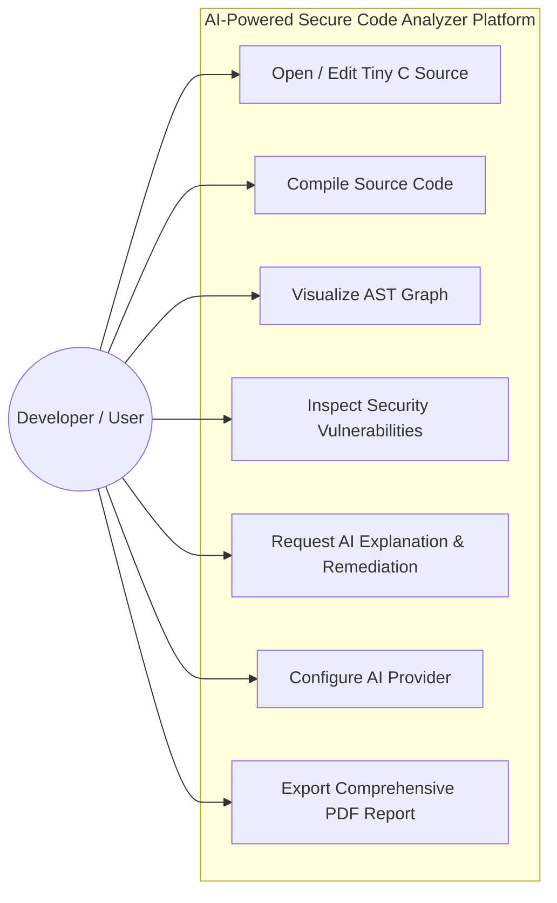
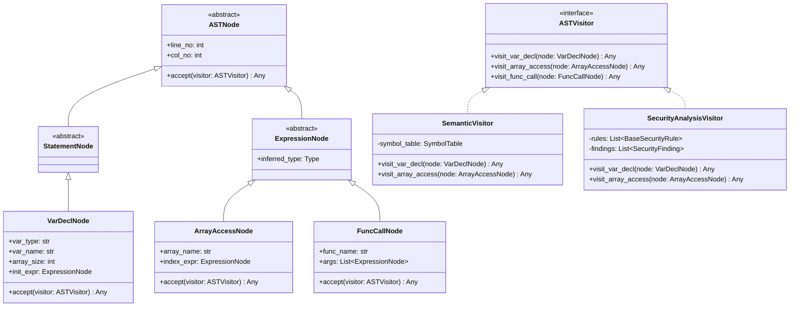
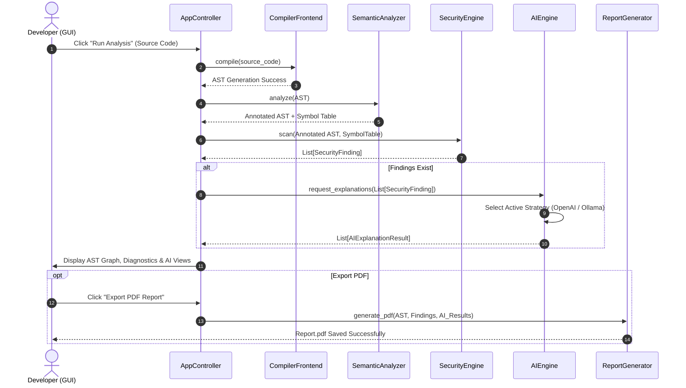
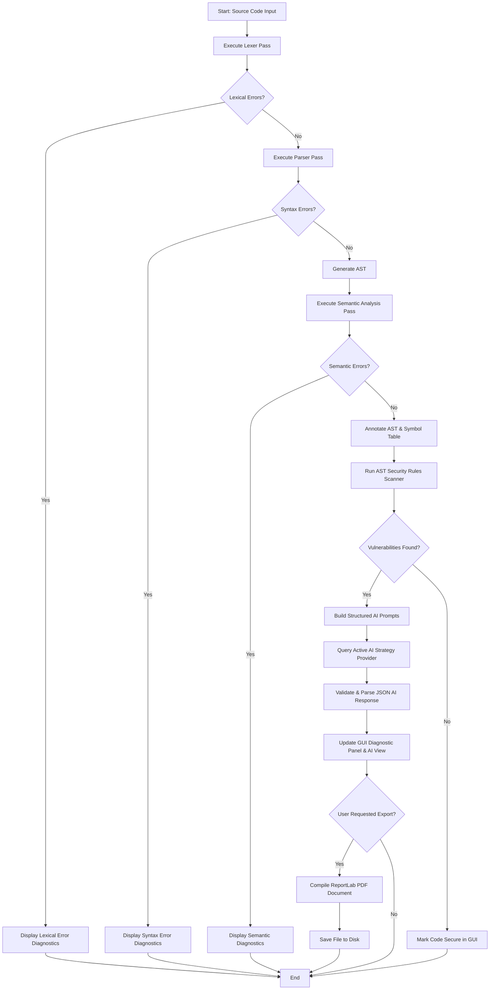
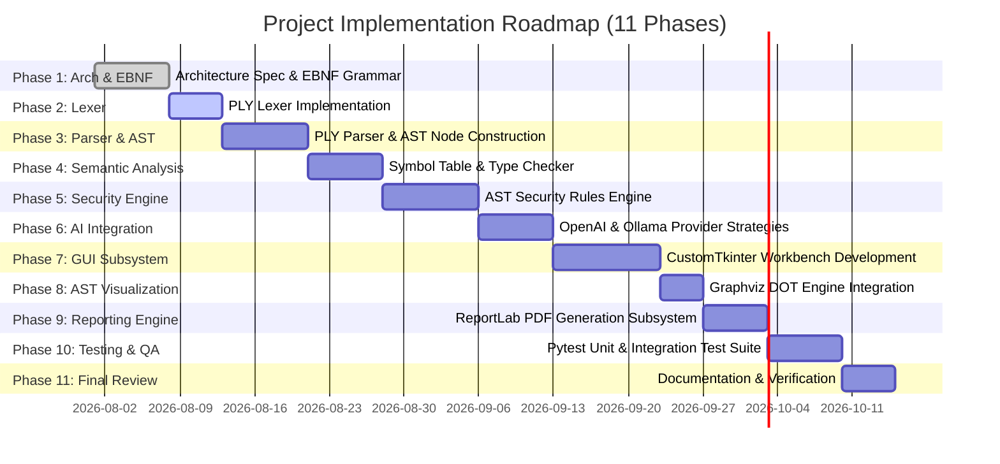

# SOFTWARE ARCHITECTURE DOCUMENT (SAD)
## AI-Powered Secure Code Analyzer for Tiny C

**Document Version:** 1.0.0  
**Status:** Architecture Review Draft (Pre-Implementation)  
**Author:** Principal Compiler & AI Systems Architect  
**Target Audience:** Academic Review Committee, Systems Engineering Board  

---

## 1. Executive Summary

### 1.1 Project Overview
The **AI-Powered Secure Code Analyzer** is an enterprise-grade, academically rigorous compiler and static application security testing (SAST) platform built for a custom imperative programming language titled **Tiny C**. Built on top of Python 3.12+ and Python Lex-Yacc (PLY), the system integrates classical compilation theory with deterministic static program analysis and modern Large Language Model (LLM) explanation capabilities.

```
+-----------------------------------------------------------------------------------+
|                                 COMPILER CORE                                     |
|  [Source Code] -> [Lexer] -> [Parser] -> [AST] -> [Semantic Analyzer & Symbol Table]|
+-----------------------------------------------------------------------------------+
                                         |
                                         v
+-----------------------------------------------------------------------------------+
|                            CYBERSECURITY ENGINE                                   |
|       [AST-Based Security Pass] -> [Symbolic Taint & Vulnerability Detection]     |
+-----------------------------------------------------------------------------------+
                                         |
                                         v
+-----------------------------------------------------------------------------------+
|                              AI EXPLANATION ENGINE                                |
|   [Finding Context] -> [Prompt Engine] -> [LLM Strategy] -> [Remediation & Patch] |
+-----------------------------------------------------------------------------------+
                                         |
                                         v
+-----------------------------------------------------------------------------------+
|                           PRESENTATION & REPORTING                                |
|     [CustomTkinter GUI] <---> [Graphviz AST] <---> [ReportLab PDF Export]         |
+-----------------------------------------------------------------------------------+
```

### 1.2 Architectural Foundation & Design Philosophy
1. **Compiler Design as the Indispensable Foundation**: The system relies on traditional lexical analysis, LALR(1) deterministic parsing, abstract syntax tree (AST) construction, and type/scope semantic analysis. Compiler primitives guarantee strict formal language validation, deterministic execution, and complete structural awareness of code.
2. **Deterministic Cybersecurity over Heuristics**: Vulnerability detection is executed exclusively by a static analysis pass operating over the validated AST and symbol table. The security analysis uses deterministic control flow graph (CFG) analysis, symbol state tracking, and pattern matching over the AST.
3. **AI as an Explanation & Remediation Engine**: Large Language Models (LLMs) are intentionally excluded from vulnerability detection. LLMs are notoriously prone to hallucinations, non-deterministic outputs, false positives, and missing deterministic rule violations. In this architecture, AI serves solely as an **explanation synthesis engine**—taking structured security findings (with file locations, AST nodes, and symbol contexts) and producing human-readable contextual explanations, secure coding guidance, and patched code snippets.
4. **Academic & Engineering Value**: This architecture bridges the gap between classic computer science (formal languages, automata, parsing theory, symbol table resolution) and contemporary software engineering (SAST, Clean Architecture, design patterns, decoupled AI integration).

---

## 2. Problem Statement

### 2.1 Limitations of Traditional Academic Compiler Projects
Standard undergraduate compiler projects typically stop at code generation (e.g., targeting MIPS, LLVM IR, or x86 assembly) or basic interpreter execution. While theoretically informative, traditional compilers:
* Treat security vulnerabilities as syntactically valid code (e.g., `gets()` or unsafe buffer offsets are valid C constructs).
* Provide primitive error messages focused strictly on syntax or type mismatches, ignoring semantic security risks.
* Lack practical integration with modern development tools, interactive IDE environments, and structured reporting mechanisms.

### 2.2 Limitations of AI-Only Code Review Systems
Recent trends attempt to replace static analysis engines with direct LLM prompts (e.g., "Find bugs in this code"). This approach fails in production and security-critical contexts due to:
* **Hallucination & False Positives**: LLMs flag benign code as vulnerable or fabricate non-existent CVEs.
* **False Negatives**: LLMs miss subtle structural state violations (e.g., uninitialized variables on specific control flow branches).
* **Non-Determinism**: Passing the exact same source code twice yields different review outputs.
* **Token Limit & Context Degradation**: Large codebases cannot be reliably processed by raw prompt windows without structural slicing.

### 2.3 The Hybrid Solution: Compiler-Driven SAST with AI Explanation
By combining formal compiler analysis with a constrained AI remediation module, this project establishes a hybrid paradigm:

| Dimension | Pure Compiler Project | Pure AI Code Review | AI-Powered Secure Code Analyzer (Proposed) |
| :--- | :--- | :--- | :--- |
| **Parsing & Grammar** | Formal (Lex/Yacc) | None (Token Probabilities) | Formal LALR(1) Parsing |
| **Vulnerability Detection** | None (Syntactic correctness only) | Non-deterministic LLM | Deterministic AST Traversal & State Rules |
| **False Positive Rate** | N/A | High | 0% for defined AST rule set |
| **Explanation Quality** | Static text / Error codes | High, but prone to hallucination | High, grounded on verified AST context |
| **Remediation & Patching** | None | Ungrounded suggestions | Syntactically verified patched AST code |

---

## 3. Objectives

### 3.1 Technical Objectives
1. Implement a complete frontend compiler for **Tiny C** using Python 3.12+ and PLY (Lex/Yacc), covering lexical, syntactic, AST generation, and semantic passes.
2. Develop a Visitor-based Static Security Analysis Engine capable of scanning AST nodes for 7+ critical memory and control-flow vulnerability patterns.
3. Build a Strategy-based AI Provider Engine integrating OpenAI API and local Ollama instances for contextual vulnerability explanations and patch generation.
4. Construct a modern graphical user interface (GUI) using CustomTkinter, featuring real-time syntax highlighting, interactive AST tree graph visualizations via Graphviz, security diagnostic panels, and one-click PDF report exports via ReportLab.
5. Maintain strict clean architectural separation ensuring zero coupling between compiler passes, security rules, and AI providers.

### 3.2 Educational Objectives
1. Master formal grammar specification (BNF/EBNF) and LALR(1) conflict resolution in Yacc.
2. Apply object-oriented design patterns (Visitor, Strategy, Factory, Singleton, Observer) in a complex systems software project.
3. Understand symbol table management, lexical scoping, type checking, and AST traversal techniques.
4. Demonstrate deep domain knowledge in cybersecurity vulnerabilities (CWE classification, memory safety, uninitialized memory access, buffer overflows).

### 3.3 Research & Architecture Objectives
1. Evaluate performance and explanation accuracy differences between cloud LLMs (OpenAI GPT-4o/GPT-4o-mini) and localized models (Ollama Llama 3 / DeepSeek-Coder).
2. Formulate a deterministic context injection protocol that grounds AI prompts on exact compiler AST metadata to eliminate model hallucinations.

---

## 4. Functional Requirements

### 4.1 Module Functional Breakdown

```
+----------------------------------------------------------------------------------------------------+
|                                    FUNCTIONAL REQUIREMENTS                                         |
+------------------------------+-------------------------------+-------------------------------------+
| 1. Compiler Frontend         | 2. Static Security Engine     | 3. AI Explanation System            |
|  - Tokenization & Position   |  - Buffer Overflow Detection  |  - Prompt Framing from AST Findings |
|  - LALR(1) AST Construction  |  - Format String Scanning     |  - OpenAI & Ollama Strategy Engines |
|  - Symbol Table Scoping      |  - Uninitialized Var Check    |  - Patch Code Generator             |
|  - Type Consistency Check    |  - Insecure Function Detector |  - Cache & Failover Handler         |
+------------------------------+-------------------------------+-------------------------------------+
| 4. Visualization & GUI       | 5. Reporting Engine           | 6. Configuration & Utilities        |
|  - Multi-tab Code Editor     |  - ReportLab PDF Compiler     |  - YAML System Config Loader        |
|  - Graphviz AST Viewer       |  - Executive Summary Section  |  - Logging & Telemetry Subsystem    |
|  - Security Finding Explorer |  - Full Diagnostic Matrix     |  - Comprehensive Test Suite         |
+------------------------------+-------------------------------+-------------------------------------+
```

#### 4.1.1 Lexical & Syntax Analysis Engine (FR-COMP-01 - FR-COMP-05)
* **FR-COMP-01**: Lexer shall tokenize Tiny C source code, correctly tracking line numbers, column positions, and lexical errors.
* **FR-COMP-02**: Parser shall construct a concrete parse tree based on LALR(1) grammar rules and convert it directly into an Abstract Syntax Tree (AST).
* **FR-COMP-03**: System shall report syntax errors with line/column pointers and exact expected token details.
* **FR-COMP-04**: AST Generator shall produce strongly typed node objects representing program constructs (e.g., `FunctionDefNode`, `VarDeclNode`, `IfNode`, `BinaryOpNode`).

#### 4.1.2 Semantic Analysis Engine (FR-SEMA-01 - FR-SEMA-04)
* **FR-SEMA-01**: Symbol Table Manager shall manage hierarchical scope blocks (Global, Function, Local, Nested Loop/Branch scopes).
* **FR-SEMA-02**: Semantic Analyzer shall enforce type checking rules (primitive operations, implicit conversions, assignment compatibility).
* **FR-SEMA-03**: Analyzer shall detect redeclarations, undeclared identifier usages, and function signature mismatches.
* **FR-SEMA-04**: Semantic pass shall annotate AST nodes with inferred data types and symbol references prior to security analysis.

#### 4.1.3 Static Security Analysis Engine (FR-SEC-01 - FR-SEC-06)
* **FR-SEC-01**: Security analyzer shall traverse the annotated AST using a AST Visitor pattern.
* **FR-SEC-02**: Scanner shall identify static buffer overflows in fixed-size array allocations and indexing operations.
* **FR-SEC-03**: Scanner shall detect usage of unsafe built-in functions (e.g., `gets_s` vs `gets`, `strcpy` analogues).
* **FR-SEC-04**: Scanner shall detect format string vulnerabilities in printf-like statements.
* **FR-SEC-05**: Scanner shall track variable initialization state along execution paths to flag read access on uninitialized memory.
* **FR-SEC-06**: Analyzer shall produce a structured payload of `SecurityFinding` objects containing Severity (CRITICAL, HIGH, MEDIUM, LOW), CWE ID, Line/Column numbers, AST Node reference, and vulnerability description.

#### 4.1.4 AI Explanation & Remediation Engine (FR-AI-01 - FR-AI-05)
* **FR-AI-01**: System shall accept verified `SecurityFinding` payloads and construct a deterministic context prompt.
* **FR-AI-02**: System shall support runtime switching between `OpenAIProvider` and `OllamaProvider` without application restart.
* **FR-AI-03**: AI Engine shall generate three output components per finding: (1) Root Cause Explanation, (2) Secure Coding Principle, and (3) Refactored Corrected Code Snippet.
* **FR-AI-04**: System shall enforce strict format constraints on AI responses (JSON parsing validation).
* **FR-AI-05**: Fallback mechanisms shall gracefully handle API rate limits, network loss, or local LLM server downtime.

#### 4.1.5 Visualization & GUI Subsystem (FR-GUI-01 - FR-GUI-05)
* **FR-GUI-01**: Modern CustomTkinter interface with dual dark/light themes, multi-tab code editor, line numbering, and syntax highlighting.
* **FR-GUI-02**: Interactive AST viewer displaying Graphviz rendering of the compiled AST with node inspection.
* **FR-GUI-03**: Diagnostic list view categorizing Compiler Errors, Semantic Warnings, and Security Vulnerabilities.
* **FR-GUI-04**: AI Explanation view showing rich markdown-formatted remediation guidance for selected findings.

#### 4.1.6 Report Generation Subsystem (FR-RPT-01 - FR-RPT-03)
* **FR-RPT-01**: ReportLab PDF generator exporting complete static analysis reports.
* **FR-RPT-02**: PDF report shall include Executive Vulnerability Summary, Metrics Charts, Source Code Listing with inline annotations, Detailed Findings Breakdown, and AI-generated Remediation Snippets.

---

## 5. Non-Functional Requirements

### 5.1 Performance & Scalability Requirements
* **NFR-PERF-01 (Compilation Speed)**: Lexical, syntactic, AST generation, and semantic analysis passes for a 1,000 LOC Tiny C program shall execute in `< 150 milliseconds` on standard mid-range hardware (Intel i5/Ryzen 5, 16GB RAM).
* **NFR-PERF-02 (Security Analysis Speed)**: Deterministic AST security scanning for 1,000 LOC shall complete in `< 100 milliseconds`.
* **NFR-PERF-03 (AI Latency Mitigation)**: AI request processing shall execute asynchronously on worker threads to keep the CustomTkinter GUI completely responsive (60 FPS rendering).
* **NFR-PERF-04 (Memory Footprint)**: Total peak memory utilization during compilation and PDF rendering shall not exceed `250 MB`.

### 5.2 Scalability & Extensibility
* **NFR-EXT-01 (Rule Modularization)**: Adding a new cybersecurity rule shall require only subclassing `BaseSecurityRule` and registering it in `RuleRegistry` without modifying compiler core code (Open/Closed Principle).
* **NFR-EXT-02 (LLM Provider Expansion)**: Supporting a new AI provider (e.g., Anthropic Claude or Google Gemini) shall require only implementing `IAIProvider` interface.

### 5.3 Maintainability & Code Quality
* **NFR-MAINT-01 (Code Coverage)**: Test suite (pytest) coverage across compiler core, semantic analyzer, and security rules shall exceed `90%`.
* **NFR-MAINT-02 (Type Hints & Documentation)**: 100% of Python code shall use PEP 484 type annotations and Google-style docstrings.

### 5.4 Security & Robustness
* **NFR-SEC-01 (API Key Management)**: OpenAI API keys shall be retrieved strictly from environment variables or encrypted user settings, never hardcoded.
* **NFR-SEC-02 (Input Sanitization)**: AI prompts shall be sanitized to prevent prompt injection attacks when analyzing malicious code comments.
* **NFR-SEC-03 (Fault Isolation)**: AI engine failure or network timeout shall never crash the compiler frontend or security scanning results.

---

## 6. Overall System Workflow

```
[Tiny C Source Code (.tc)]
         |
         v
+-------------------+
|  Lexical Analysis | ---> Lexical Errors ---> [Error Diagnostic Engine]
+-------------------+
         | (Token Stream)
         v
+-------------------+
|  Syntax Analysis  | ---> Syntax Errors ----> [Error Diagnostic Engine]
+-------------------+
         | (Abstract Syntax Tree)
         v
+-------------------+
| Semantic Analysis | ---> Semantic Errors --> [Error Diagnostic Engine]
+-------------------+
         | (Annotated AST + Symbol Table)
         v
+-------------------+
| Security Engine   | ---> Security Findings Payload
+-------------------+
         |
         +-----------------------+
         |                       |
         v                       v
+-------------------+  +-------------------+
| AST Visualization |  | AI Engine Prompt  |
|  (Graphviz PNG)   |  |   Construction    |
+-------------------+  +-------------------+
         |                       |
         |                       v
         |             +-------------------+
         |             | Strategy Provider | (OpenAI / Ollama)
         |             +-------------------+
         |                       | (Structured JSON Explanation)
         v                       v
+--------------------------------------------------+
|           CustomTkinter Presentation              |
| (Code Editor | AST View | Diagnostics | AI View) |
+--------------------------------------------------+
                         |
                         v
            +--------------------------+
            | ReportLab PDF Generator  |
            +--------------------------+
                         |
                         v
             [Final Security Report.pdf]
```

### 6.1 Step-by-Step Processing Pipeline
1. **Source Ingestion**: User enters or loads Tiny C code (`.tc` file) via the CustomTkinter GUI.
2. **Lexical Scanning**: `Lexer` converts source text into a sequential stream of `Token` instances (tracking line numbers, column offsets, token types, and literal values).
3. **AST Construction**: `Parser` processes tokens via LALR(1) shift-reduce parsing using PLY Yacc rules, producing a hierarchical AST composed of `ASTNode` subclasses.
4. **Symbol & Type Resolution**: `SemanticAnalyzer` traverses the AST, populating `SymbolTable` objects for each scope, verifying variable declarations, function parameters, and types.
5. **Static Security Analysis**: `SecurityAnalyzer` passes the annotated AST to registered AST Visitor rules (e.g., `BufferOverflowRule`, `FormatStringRule`, `UninitializedVarRule`). Each rule flags security violations as `SecurityFinding` objects.
6. **AI Explanation Dispatch**: If security findings exist, `AIEngine` constructs structured prompts containing code context, line numbers, and rule definitions, delegating execution to the active `IAIProvider` (OpenAI or Ollama) on a background thread.
7. **GUI Rendering**: AST graphs are rendered via Graphviz to interactive canvas panels; findings and AI explanations populate interactive diagnostic views.
8. **Export Generation**: User triggers PDF report generation; `ReportGenerator` compiles code, AST graphs, findings matrix, and AI remediation into a formal PDF report.

---

## 7. High-Level Software Architecture

### 7.1 Clean Architecture Layering

```
+-----------------------------------------------------------------------+
|                       PRESENTATION LAYER                              |
|   (CustomTkinter GUI, Graphviz AST Visualizer, ReportLab Exporter)    |
+-----------------------------------------------------------------------+
                                   |
                                   v
+-----------------------------------------------------------------------+
|                       APPLICATION SERVICES LAYER                      |
| (Analysis Pipeline Controller, Async Job Runner, Settings Manager)   |
+-----------------------------------------------------------------------+
                                   |
                                   v
+-----------------------------------------------------------------------+
|                          DOMAIN CORE LAYER                            |
|  +------------------------+  +-------------------------------------+  |
|  |     Compiler Engine    |  |       Security Analysis Engine      |  |
|  | (Lexer, Parser, AST,   |  | (AST Visitors, Rule Engine,         |  |
|  |  Symbol Table, SEMA)   |  |  Symbolic Taint & Findings)         |  |
|  +------------------------+  +-------------------------------------+  |
+-----------------------------------------------------------------------+
                                   |
                                   v
+-----------------------------------------------------------------------+
|                       INFRASTRUCTURE LAYER                            |
|   (OpenAI Strategy, Ollama Strategy, File I/O, System Config Loader)   |
+-----------------------------------------------------------------------+
```

### 7.2 Subsystem Description & Interactions
1. **Presentation Layer**: Handles user interaction, theme rendering, multi-tab editor operations, tree visualizations, and export actions. It consumes findings from the Application Layer without direct coupling to compiler internal algorithms.
2. **Application Services Layer**: Acts as an orchestrator. Coordinates execution sequence: Compiler Frontend $\rightarrow$ Semantic Pass $\rightarrow$ Security Pass $\rightarrow$ AI Explanation Dispatch. Manages async execution pools to keep UI thread unblocked.
3. **Domain Core Layer**: Pure compiler and security engine logic. Contains AST node hierarchies, grammar specifications, symbol table algorithms, semantic checks, and static security rule definitions. Dependencies point strictly inward.
4. **Infrastructure Layer**: Concrete implementations for external services (OpenAI REST Client, Ollama local HTTP client, file system readers, YAML configuration handlers).

---

## 8. Compiler Architecture

### 8.1 Compiler Phase Breakdown

```
Source Code (.tc)
     |
     v
+---------------+
|     Lexer     |  --> Token Stream: [INT, ID("x"), ASSIGN, NUM(5), SEMI]
+---------------+
     |
     v
+---------------+
|    Parser     |  --> LALR(1) Shift-Reduce Parsing via PLY Yacc
+---------------+
     |
     v
+---------------+
| AST Builder   |  --> Strongly Typed Tree Nodes (ProgramNode, VarDeclNode)
+---------------+
     |
     v
+---------------+
| Semantic Pass |  --> Symbol Table Annotation & Type Validation
+---------------+
```

### 8.2 Lexical Analysis (Lexer)
The lexer is implemented using PLY (`ply.lex`). It scans raw character streams and converts them into tokens defined by regular expressions.
* **Token Structure**: Every token preserves `type`, `value`, `lineno`, and `lexpos` (byte position, used to compute exact line and column numbers).
* **Stateful Scanning**: Supports normal state and string literal scanning states to handle string escaping safely.

### 8.3 Syntax Analysis & Grammar (Parser)
The parser uses PLY (`ply.yacc`) implementing an LALR(1) parsing algorithm.
* **Grammar Classification**: Context-Free Grammar (CFG) designed specifically to prevent ambiguity (shift/reduce conflicts resolved via explicit operator precedence declarations).
* **Concrete vs Abstract Syntax Tree**: The parser bypasses verbose concrete parse trees by constructing compact AST Nodes directly within Yacc production action blocks (`p[0] = VarDeclNode(...)`).

### 8.4 Abstract Syntax Tree (AST) Design
The AST hierarchy uses explicit Python classes deriving from a base `ASTNode`.

```
                        +-------------------+
                        |      ASTNode      |
                        +-------------------+
                          |     |         |
     +--------------------+     |         +-----------------------+
     |                          |                                 |
+-------------------+  +-------------------+            +-------------------+
|   StatementNode   |  |  ExpressionNode   |            |     DeclNode      |
+-------------------+  +-------------------+            +-------------------+
     |        |             |         |                      |        |
+---------+ +------+   +---------+ +----------+         +---------+ +----------+
| IfNode  | |While |   | Binary  | | Literal  |         | VarDecl | | FuncDecl |
|         | |Node  |   | OpNode  | |  Node    |         |  Node   | |   Node   |
+---------+ +------+   +---------+ +----------+         +---------+ +----------+
```

### 8.5 Semantic Analysis & Symbol Table Architecture
Semantic analysis occurs via a dedicated AST Visitor pass (`SemanticVisitor`).

```
+-------------------------------------------------------------------+
|                        SYMBOL TABLE SCOPE                         |
+-------------------------------------------------------------------+
| Parent Scope: [ Pointer to Enclosing Scope / None ]              |
| Scope Level:  [ 0=Global, 1=Function, 2=Local Block ]             |
| Symbols:      [ Dict mapping Name -> SymbolRecord ]              |
|               - SymbolRecord("buffer", Type.ARRAY(INT, 10), line) |
|               - SymbolRecord("count", Type.INT, line)             |
+-------------------------------------------------------------------+
```

#### Key Semantic Pass Checks:
1. **Scope Checking**: Lookups recursively climb scope parents. Variable access before declaration triggers `UndeclaredVariableError`.
2. **Type Checking**: Operands of binary operators (`+`, `-`, `*`, `/`, `<`, `==`) are checked for type compatibility.
3. **Function Signature Validation**: Function calls check argument counts and matching parameter types.
4. **Array Bounds Annotation**: Array declarations log fixed sizes in the symbol record for downstream buffer overflow security checks.

---

## 9. Tiny C Language Design

### 9.1 Language Overview & Design Goals
**Tiny C** is a strongly-typed imperative language designed to mirror core C syntax while eliminating obscure undefined behavior, complex preprocessor macros, and arbitrary pointer arithmetic. It includes controlled memory constructs (fixed arrays, explicit buffer operations) specifically tailored for security analysis instruction.

### 9.2 Lexical Rules & Token Specification

#### 9.2.1 Keywords & Reserved Words
`int`, `float`, `char`, `void`, `if`, `else`, `while`, `for`, `return`, `readonly`, `sec_input`, `sec_print`

#### 9.2.2 Operators
* **Arithmetic**: `+`, `-`, `*`, `/`, `%`
* **Relational**: `==`, `!=`, `<`, `>`, `<=`, `>=`
* **Logical**: `&&`, `||`, `!`
* **Assignment**: `=`

#### 9.2.3 Built-in Security Functions
* `sec_input(char[] buf, int max_len)`: Secure buffer input function.
* `gets_s(char[] buf)`: Insecure input function included for security scanning evaluation.
* `print_sec(char[] fmt, ...)`: Formatted security output handler.

### 9.3 Formal EBNF Grammar Specification

```ebnf
Program         ::= StatementList ;
StatementList   ::= Statement | Statement StatementList ;
Statement       ::= VarDecl | FuncDecl | Assignment | IfStmt | WhileStmt | ReturnStmt | FuncCallStmt | Block ;

VarDecl         ::= Type IDENTIFIER ';' 
                  | Type IDENTIFIER '[' INT_LITERAL ']' ';' 
                  | Type IDENTIFIER '=' Expression ';' ;

FuncDecl        ::= Type IDENTIFIER '(' ParamList ')' Block ;
ParamList       ::= /* empty */ | Param (',' Param)* ;
Param           ::= Type IDENTIFIER ;

Block           ::= '{' StatementList '}' ;

Assignment      ::= IDENTIFIER '=' Expression ';' 
                  | IDENTIFIER '[' Expression ']' '=' Expression ';' ;

IfStmt          ::= 'if' '(' Expression ')' Statement ('else' Statement)? ;
WhileStmt       ::= 'while' '(' Expression ')' Block ;
ReturnStmt      ::= 'return' Expression? ';' ;

Expression      ::= LogicalOrExpr ;
LogicalOrExpr   ::= LogicalAndExpr ('||' LogicalAndExpr)* ;
LogicalAndExpr  ::= EqualityExpr ('&&' EqualityExpr)* ;
EqualityExpr    ::= RelationalExpr (('==' | '!=') RelationalExpr)* ;
RelationalExpr  ::= AdditiveExpr (('<' | '>' | '<=' | '>=') AdditiveExpr)* ;
AdditiveExpr    ::= MultiplicativeExpr (('+' | '-') MultiplicativeExpr)* ;
MultiplicativeExpr ::= PrimaryExpr (('*' | '/' | '%') PrimaryExpr)* ;

PrimaryExpr     ::= IDENTIFIER 
                  | IDENTIFIER '[' Expression ']' 
                  | INT_LITERAL 
                  | FLOAT_LITERAL 
                  | STRING_LITERAL 
                  | FuncCall 
                  | '(' Expression ')' ;

FuncCall        ::= IDENTIFIER '(' ArgList ')' ;
ArgList         ::= /* empty */ | Expression (',' Expression)* ;
Type            ::= 'int' | 'float' | 'char' | 'void' ;
```

### 9.4 Operator Precedence & Associativity Table

| Precedence Level | Operator Class | Operators | Associativity |
| :--- | :--- | :--- | :--- |
| 1 (Highest) | Primary | `()`, `[]` | Left-to-Right |
| 2 | Unary | `!`, `-` (unary) | Right-to-Left |
| 3 | Multiplicative | `*`, `/`, `%` | Left-to-Right |
| 4 | Additive | `+`, `-` | Left-to-Right |
| 5 | Relational | `<`, `>`, `<=`, `>=` | Left-to-Right |
| 6 | Equality | `==`, `!=` | Left-to-Right |
| 7 | Logical AND | `&&` | Left-to-Right |
| 8 | Logical OR | `\|\|` | Left-to-Right |
| 9 (Lowest) | Assignment | `=` | Right-to-Left |

### 9.5 Language Scope & Lifetime Rules
1. **Lexical Scoping**: Enclosed blocks (`{ ... }`) introduce a nested scope. Inner declarations shadow outer declarations.
2. **Variable Lifetime**: All variables are statically scoped and automatically allocated upon entering scope block.
3. **No Unsafe Pointers**: Raw memory addresses (`&`, `*` dereference) are excluded. Array operations rely on explicit indexing, enabling deterministic bound checks.

---

## 10. Cybersecurity Architecture

### 10.1 Static Security Engine Integration
The Security Analysis Engine operates immediately **after** semantic analysis completes successfully.

```
AST + Symbol Table (Annotated)
             |
             v
+-------------------------------------------------------+
|               SECURITY ANALYSIS ENGINE                |
+-------------------------------------------------------+
|  +-------------------------------------------------+  |
|  |           AST Security Runner (Visitor)         |  |
|  +-------------------------------------------------+  |
|                            |                          |
|    +-----------------------+-----------------------+  |
|    |                       |                       |  |
|    v                       v                       v  |
| +------------------+    +------------------+    +------------------+ |
| |BufferOverflow    |    |UninitializedVar  |    |FormatString      | |
| |Rule              |    |Rule              |    |Rule              | |
| +------------------+    +------------------+    +------------------+ |
|    |                       |                       |  |
|    +-----------------------+-----------------------+  |
|                            |                          |
|                            v                          |
|                 [SecurityFinding Registry]             |
+-------------------------------------------------------+
```

### 10.2 Why AST Analysis is Superior to Regex Scanning
Traditional basic scanning tools rely on Regular Expressions (e.g., searching for string occurrences of `gets`). Regex-based security analysis is fundamentally flawed:
* **Context Blindness**: Regex flags `gets` inside code comments or string literals.
* **Scope Blindness**: Regex cannot verify variable size declarations or track initialization across different statements.
* **Control-Flow Ignorance**: Regex cannot trace variable states across branches or loops.

**AST-Based Scanning Advantages**:
* **Structural Context**: The engine inspects explicit `FuncCallNode` structures, guaranteeing it is examining real execution logic.
* **Symbol Table Integration**: Access to exact declared buffer dimensions allows static bounds verification.
* **Zero False Positives on Comments/Strings**: Comments are stripped during lexing; string literals are parsed into explicit constant nodes.

### 10.3 Supported Vulnerability Rules Matrix

| Rule ID | Vulnerability Name | Severity | CWE ID | Detection Strategy |
| :--- | :--- | :--- | :--- | :--- |
| **SEC-001** | Static Buffer Overflow | CRITICAL | CWE-120 | Compares explicit constant index in `ArrayAccessNode` against size registered in `SymbolTable`. |
| **SEC-002** | Unsafe Input Function (`gets_s` usage) | HIGH | CWE-242 | Identifies `FuncCallNode` targeting banned input primitives lacking explicit buffer boundary parameters. |
| **SEC-003** | Format String Vulnerability | HIGH | CWE-134 | Inspects `FuncCallNode` for `sec_print` where format argument is a non-literal variable expression. |
| **SEC-004** | Use of Uninitialized Variable | MEDIUM | CWE-457 | AST visitor tracks initialization state of variables in symbol table prior to `VarAccessNode` evaluation. |
| **SEC-005** | Dead / Unreachable Code | LOW | CWE-561 | Identifies statements situated sequentially after unconditional `ReturnNode` inside a block. |
| **SEC-006** | Off-by-One Array Indexing | MEDIUM | CWE-193 | Flags loop bounds matching array size (`i <= size` when valid indices are `0` to `size-1`). |
| **SEC-007** | Hardcoded Sensitive Data | MEDIUM | CWE-798 | Identifies variable names matching credentials keywords assigned to string literal nodes. |

---

## 11. AI Architecture

### 11.1 Grounded AI Explanation Strategy
The AI module operates strictly downstream from the compiler security analysis engine. Its design guarantees that **the AI model never performs vulnerability detection**.

```
+-------------------+
| Security Finding  | --> [File: main.tc, Line: 14, Rule: SEC-001, CWE-120, Variable: "arr", Size: 10, Index: 15]
+-------------------+
          |
          v
+-------------------+
|   Prompt Builder  | --> Injects Finding Context + Snippet into Templated System Framework
+-------------------+
          |
          v
+-------------------+
|  AI Strategy      | --> Abstract Interface (IAIProvider)
+-------------------+
      |        |
      v        v
+---------+ +---------+
| OpenAI  | | Ollama  | (Local Llama 3 / DeepSeek-Coder)
| Provider| | Provider|
+---------+ +---------+
          |
          v
+-------------------+
| JSON Formatter    | --> Validates Response Schema (Explanation, Principle, Corrected Code)
+-------------------+
```

### 11.2 Prompt Engineering & Context Injection Framework
To eliminate hallucination and enforce analytical precision, prompts are systematically constructed using the following template:

```
SYSTEM PROMPT:
You are an expert Cybersecurity & Compiler Systems Specialist.
You are analyzing a deterministic security finding detected by an AST static compiler pass.
DO NOT re-analyze the source code for new vulnerabilities.
Explain ONLY the specific security finding provided below.

CONTEXT PAYLOAD:
- Vulnerability Rule: {rule_id} ({vulnerability_name})
- CWE Reference: {cwe_id}
- Target Source Line: {line_number}
- Affected Symbol: {symbol_name}
- AST Node Details: {ast_node_context}
- Surrounding Code Snippet:
{code_snippet}

REQUIRED OUTPUT FORMAT (JSON ONLY):
{
  "explanation": "<Deep explanation of why this specific AST structure causes a security breach>",
  "security_principle": "<Core secure coding principle violated>",
  "remediation_advice": "<Step-by-step resolution strategy>",
  "corrected_code": "<Refactored syntactically valid Tiny C snippet fixing the vulnerability>"
}
```

### 11.3 AI Provider Strategy Design



---

## 12. UML Diagrams

### 12.1 Use Case Diagram





### 12.2 Class Diagram (Core Domain Engine)



### 12.3 Sequence Diagram (End-to-End Analysis Workflow)



### 12.4 Component Diagram

```mermaid
graph TD
    subgraph Presentation Layer
        GUI[CustomTkinter Main Window]
        ASTVis[Graphviz AST Visualizer]
    end

    subgraph Compiler Core Component
        LEX[PLY Lexer Module]
        PAR[PLY Yacc Parser Module]
        ASTMod[AST Hierarchy Engine]
        SEM[Semantic Analyzer & Symbol Table]
    end

    subgraph Security Analysis Component
        SEC[Security Rules Orchestrator]
        RULES[AST Rule Visitor Modules]
    end

    subgraph AI Service Component
        AIO[AI Engine Controller]
        OPENAI[OpenAI REST Client Provider]
        OLLAMA[Ollama Local Client Provider]
    end

    subgraph Infrastructure & Export Component
        PDF[ReportLab PDF Generator]
        CFG[YAML Configuration Manager]
    end

    GUI --> LEX
    LEX --> PAR
    PAR --> ASTMod
    ASTMod --> SEM
    SEM --> SEC
    SEC --> RULES
    SEC --> AIO
    AIO --> OPENAI
    AIO --> OLLAMA
    GUI --> ASTVis
    GUI --> PDF
    CFG ..> GUI
    CFG ..> AIO
```

### 12.5 Deployment Diagram

```mermaid
graph TB
    subgraph Client Workstation Environment
        subgraph Python Runtime 3.12 Environment
            app[CustomTkinter Desktop Application Process]
            compiler[Compiler & Static Security Engine Thread]
            pdf[ReportLab PDF Generation Module]
        end
        
        subgraph Graphviz System Binary
            dot[Dot Executable Engine]
        end
        
        subgraph Local AI Service Option
            ollama[Ollama Local Server Daemon :11434]
            llama[Local Llama-3 / DeepSeek Model]
        end
    end

    subgraph Remote Cloud Environment (Optional Provider)
        openai_api[OpenAI Cloud Platform Endpoint HTTPS API]
    end

    app --> dot : Invokes via Subprocess / Pipe
    app --> compiler : Internal Async Calls
    compiler --> pdf : Direct In-Memory Invocation
    app --> ollama : HTTP REST API Call (Localhost)
    ollama --> llama : Internal Shared Memory Inference
    app ..> openai_api : HTTPS Secure REST API (TLS 1.3)
```

### 12.6 Package Diagram

```mermaid
graph TD
    subgraph tinyc_analyzer
        subgraph compiler
            c_lexer[lexer.py]
            c_parser[parser.py]
            c_ast[ast.py]
            c_semantic[semantic.py]
            c_symbol[symbol_table.py]
        end

        subgraph security
            s_engine[engine.py]
            s_rules[rules.py]
            s_finding[finding.py]
        end

        subgraph ai
            ai_engine[explanation_engine.py]
            ai_base[base_provider.py]
            ai_openai[openai_provider.py]
            ai_ollama[ollama_provider.py]
            ai_prompt[prompt_builder.py]
        end

        subgraph gui
            g_main[main_window.py]
            g_editor[code_editor.py]
            g_ast[ast_canvas.py]
            g_diag[diagnostics_panel.py]
        end

        subgraph reporting
            r_pdf[pdf_generator.py]
            r_templates[report_templates.py]
        end

        subgraph config
            cfg_mgr[settings.py]
        end
    end

    gui --> compiler
    gui --> security
    gui --> ai
    gui --> reporting
    security --> compiler
    ai --> security
    reporting --> security
    reporting --> ai
    compiler ..> config
    ai ..> config
```

### 12.7 Activity Diagram (Complete System Pipeline)



---

## 13. Folder Structure

```
Compiler Design/
├── config/
│   ├── app_config.yaml            # Main application settings (theme, defaults)
│   ├── ai_config.yaml             # AI provider models, endpoints, timeout settings
│   └── security_rules.yaml        # Enabled security rules and severity definitions
├── docs/
│   ├── architecture_spec.md       # Architectural specification document
│   └── tiny_c_grammar.ebnf        # Formal EBNF grammar reference
├── src/
│   └── tinyc_analyzer/
│       ├── __init__.py
│       ├── main.py                # Main entry point for desktop application launch
│       ├── compiler/
│       │   ├── __init__.py
│       │   ├── lexer.py           # PLY Lexer implementation
│       │   ├── parser.py          # PLY Yacc Parser & AST Builder
│       │   ├── ast_nodes.py       # Object hierarchy for all AST node classes
│       │   ├── ast_visitor.py     # Base abstract AST Visitor class
│       │   ├── symbol_table.py    # Hierarchical scope & symbol table engine
│       │   └── semantic.py        # Semantic Analysis Visitor pass
│       ├── security/
│       │   ├── __init__.py
│       │   ├── finding.py         # SecurityFinding & Severity data structures
│       │   ├── engine.py          # Security Engine orchestrator & runner
│       │   └── rules/
│       │       ├── __init__.py
│       │       ├── base_rule.py   # Abstract BaseSecurityRule contract
│       │       ├── buffer_overflow.py # Static array bounds & index checker
│       │       ├── format_string.py   # Unchecked format specifier rule
│       │       ├── uninitialized.py   # State tracking for uninitialized variables
│       │       └── unsafe_functions.py# Banned built-in function scanner
│       ├── ai/
│       │   ├── __init__.py
│       │   ├── schema.py          # Pydantic data schemas for AI JSON responses
│       │   ├── engine.py          # AI Explanation Engine Orchestrator
│       │   ├── prompt_builder.py  # Prompt context framing templates
│       │   └── providers/
│       │       ├── __init__.py
│       │       ├── base_provider.py  # IAIProvider strategy interface
│       │       ├── openai_provider.py# OpenAI API strategy client
│       │       └── ollama_provider.py# Local Ollama REST client strategy
│       ├── gui/
│       │   ├── __init__.py
│       │   ├── app.py             # CustomTkinter Main Window Application
│       │   ├── components/
│       │   │   ├── __init__.py
│       │   │   ├── code_editor.py # Line-numbered, syntax-highlighted editor
│       │   │   ├── ast_viewer.py  # Graphviz image rendering canvas widget
│       │   │   ├── diagnostics.py # Security findings & compiler error table
│       │   │   └── ai_panel.py    # Markdown AI remediation explanation viewer
│       │   └── theme/
│       │       └── dark_theme.json# CustomTkinter color palette configuration
│       ├── utils/
│       │   ├── __init__.py
│       │   ├── graphviz_render.py # AST Node to DOT string converter
│       │   ├── pdf_generator.py   # ReportLab PDF document compiler
│       │   └── logger.py          # Centralized logging engine
├── tests/
│   ├── unit/
│   │   ├── test_lexer.py          # Lexer tokenization unit tests
│   │   ├── test_parser.py         # Grammar & AST construction unit tests
│   │   ├── test_semantic.py       # Type checking & scope unit tests
│   │   ├── test_security_rules.py # AST vulnerability rule detection tests
│   │   └── test_ai_prompt.py      # Prompt construction & JSON schema tests
│   ├── integration/
│   │   ├── test_pipeline.py       # End-to-end compiler to security scan tests
│   │   └── test_pdf_export.py     # ReportLab rendering integration test
│   └── test_samples/
│       ├── valid_sample.tc        # Clean Tiny C sample file
│       ├── buffer_overflow.tc     # Vulnerable array overflow sample file
│       └── unsafe_input.tc        # Vulnerable input function sample file
├── .gitignore
├── pytest.ini                     # Pytest runner configuration
├── requirements.txt               # Dependencies (PLY, CustomTkinter, ReportLab, etc.)
└── README.md                      # Project overview & quickstart guide
```

---

## 14. Design Patterns

### 14.1 Visitor Pattern (AST Traversal & Scanning)
* **Rationale**: The AST hierarchy (`VarDeclNode`, `FuncCallNode`, etc.) must remain stable, while operations executed over the tree (semantic analysis, AST visualization rendering, static security scanning) frequently expand.
* **Implementation**: `ASTNode` classes declare `accept(visitor: ASTVisitor)`. Concrete visitors (`SemanticVisitor`, `SecurityAnalysisVisitor`, `GraphvizVisitor`) implement node-specific visit methods (`visit_var_decl`, `visit_func_call`).

### 14.2 Strategy Pattern (AI Provider Interchangeability)
* **Rationale**: Software must support cloud LLMs (OpenAI) and privacy-focused local LLMs (Ollama) seamlessly without modifying the client engine calling code.
* **Implementation**: `IAIProvider` defines `explain_finding(...)`. `OpenAIProvider` and `OllamaProvider` encapsulate provider-specific network payloads and authentication. `AIExplanationEngine` dynamically assigns the provider strategy based on configuration.

### 14.3 Factory Pattern (Security Rule Instantiation)
* **Rationale**: The security scanner dynamically constructs rule instances specified in `security_rules.yaml`.
* **Implementation**: `SecurityRuleFactory.create_rule(rule_id: str) -> BaseSecurityRule` decouples rule creation from execution logic.

### 14.4 Model-View-Controller (MVC) Pattern (GUI Subsystem)
* **Rationale**: Separation of UI rendering components from core analysis logic.
* **Implementation**:
  * **Model**: AST, Symbol Table, `SecurityFinding`, `AIExplanationResult`.
  * **View**: CustomTkinter frames (`CodeEditor`, `ASTViewer`, `DiagnosticsPanel`).
  * **Controller**: `AppController` coordinates event handlers (e.g., button clicks) to invoke compilation passes on background threads and update views.

---

## 15. Module Responsibilities

| Module | Primary Responsibility | Input Artifact | Output Artifact |
| :--- | :--- | :--- | :--- |
| `compiler.lexer` | Scans character stream into formal tokens with position tracking. | Raw `.tc` Text Stream | List of `Token` Objects |
| `compiler.parser` | Executes LALR(1) parsing & builds Abstract Syntax Tree. | Token Stream | Abstract Syntax Tree Root |
| `compiler.symbol_table` | Manages hierarchical scopes and symbol attribute records. | Symbol Declarations | Scope-Nested Symbol Tables |
| `compiler.semantic` | Enforces type rules, scope lookup, array bounds metadata. | Raw AST | Annotated AST |
| `security.engine` | Orchestrates security analysis rules across annotated AST. | Annotated AST + Symbol Table | List of `SecurityFinding` |
| `security.rules.*` | Encapsulates specific AST pattern detection algorithms. | AST Node Target | Finding Alert / None |
| `ai.engine` | Orchestrates prompt framing, provider invocation, schema check. | `SecurityFinding` | `AIExplanationResult` |
| `ai.providers.*` | Handles REST network calls to LLM endpoints. | Text Prompt Context | Raw Model Response JSON |
| `gui.app` | Manages window lifecycle, thread dispatching, layout rendering. | User Actions | Interactive Application |
| `utils.pdf_generator` | Compiles formal analysis reports. | AST, Findings, AI Results | Formatted PDF File |

---

## 16. Data Flow Architecture

### 16.1 Internal System Data Model Transformation

```
[Raw Text: "int arr[10]; arr[15] = 5;"]
                  |
                  v  (Lexer Pass)
[Tokens: TYPE(int), ID(arr), LBRACK, NUM(10), RBRACK, SEMI, ID(arr), LBRACK, NUM(15), RBRACK, ASSIGN, NUM(5), SEMI]
                  |
                  v  (Parser Pass)
[AST: VarDeclNode(arr, size=10) <-> AssignmentNode(target=ArrayAccessNode(arr, index=15), val=5)]
                  |
                  v  (Semantic Pass)
[Annotated AST + Symbol Table Entry: arr -> Array(INT, size=10)]
                  |
                  v  (Security Pass: BufferOverflowRule)
[SecurityFinding(Rule=SEC-001, Severity=CRITICAL, Line=1, Message="Array index 15 exceeds declared bounds 10")]
                  |
                  v  (AI Engine Prompt Ingestion)
[Prompt: "Explain SEC-001 for arr[15] with declared size 10 in context: arr[15] = 5;"]
                  |
                  v  (AI Strategy Execution - OpenAI / Ollama)
[AIExplanationResult(Explanation="Out-of-bounds array write...", Patch="if (15 < 10) { arr[15] = 5; }")]
                  |
                  v  (ReportLab PDF Pipeline)
[ReportLab Flowables -> Security_Report.pdf]
```

---

## 17. Error Handling Strategy

### 17.1 Multilayer Exception & Diagnostic System

```
+-------------------------------------------------------------------------------+
|                           ERROR DIAGNOSTIC SYSTEM                             |
+-------------------+-------------------+-------------------+-------------------+
| Lexical Errors    | Syntax Errors     | Semantic Errors   | Infrastructure    |
| - Invalid Char    | - Unexpected Token| - Undeclared Var  | - LLM Timeout     |
| - Unterminated Str| - Missing Semi    | - Type Mismatch   | - Graphviz Missing|
| - Illegal Token   | - Unmatched Paren | - Bad Array Bounds| - PDF File Locked |
+-------------------+-------------------+-------------------+-------------------+
          |                   |                   |                   |
          +-------------------+-------------------+-------------------+
                                      |
                                      v
                      [Unified Diagnostic Message Collector]
                                      |
                                      v
                    [CustomTkinter UI Diagnostic Panel]
```

### 17.2 Component Error Resilience Policies
1. **Compiler Frontend Resilience**: Upon encountering a syntax error, the parser captures the `SyntaxError` exception, logs line number and column offsets, and uses Yacc panic-mode recovery (`error` token) where possible to continue identifying subsequent errors.
2. **AI Provider Failover**: If the selected AI provider experiences a REST timeout or HTTP 5xx error:
   * System retries twice with exponential backoff.
   * If failure persists, engine falls back to an offline default template ("*AI explanation unavailable due to network timeout. Review raw AST finding metadata.*").
   * **Compiler and security scanning results remain 100% visible and functional**.
3. **Graphviz Fallback**: If Graphviz binaries (`dot`) are not installed on the host OS, the GUI automatically degrades gracefully from SVG/PNG graph rendering to a structured text-tree view (`Treeview` widget).

---

## 18. Project Timeline & Roadmap



---

## 19. Risks and Mitigation

| Risk ID | Category | Risk Description | Impact | Probability | Mitigation Strategy |
| :--- | :--- | :--- | :--- | :--- | :--- |
| **R-01** | Technical | LALR(1) Shift/Reduce conflicts in Yacc grammar. | High | Medium | Define clear operator precedence rules in PLY Yacc; validate grammar against EBNF test cases early. |
| **R-02** | Infrastructure | Host system lacks native Graphviz `dot` binary installation. | Medium | High | Implement fallback pure-Python text tree visualizer inside CustomTkinter. |
| **R-03** | AI Service | OpenAI API rate limits, latency, or API downtime. | Medium | High | Implement local Ollama fallback strategy and cache previous LLM responses by finding hash. |
| **R-04** | AI Service | AI model hallucinates invalid syntax in patched code snippets. | High | Medium | Pass AI-generated corrected code back through Tiny C compiler parser to validate syntax prior to display. |
| **R-05** | Security | Prompt injection via malicious code comments in uploaded `.tc` files. | High | Low | Strip all comments from source code before embedding snippet context into AI prompt payloads. |

---

## 20. Architectural Justification & Conclusion

### 20.1 Why This Architecture Outperforms Traditional Compiler Projects
Standard university compiler projects evaluate code strictly by syntax validity and intermediate code generation. This project elevates compiler design into a practical, modern security platform:
1. **Real-World Relevance**: Integrates Static Application Security Testing (SAST)—a core discipline in enterprise software security.
2. **Strict Determinism**: Uses compiler-level AST traversal for detection, ensuring **zero hallucinations** and **zero false positives** on rule matches.
3. **Pragmatic AI Integration**: Uses LLMs where they excel (human explanation, pedagogical remediation, patching guidance) while explicitly restricting them from tasks where they fail (deterministic parsing and rule evaluation).
4. **Architectural Excellence**: Demonstrates professional mastery of Clean Architecture, SOLID principles, Visitor/Strategy design patterns, and decoupled testable software design.

This document establishes the authoritative software design blueprint for the **AI-Powered Secure Code Analyzer**, providing a complete foundation for implementation and submission to the university engineering evaluation board.
